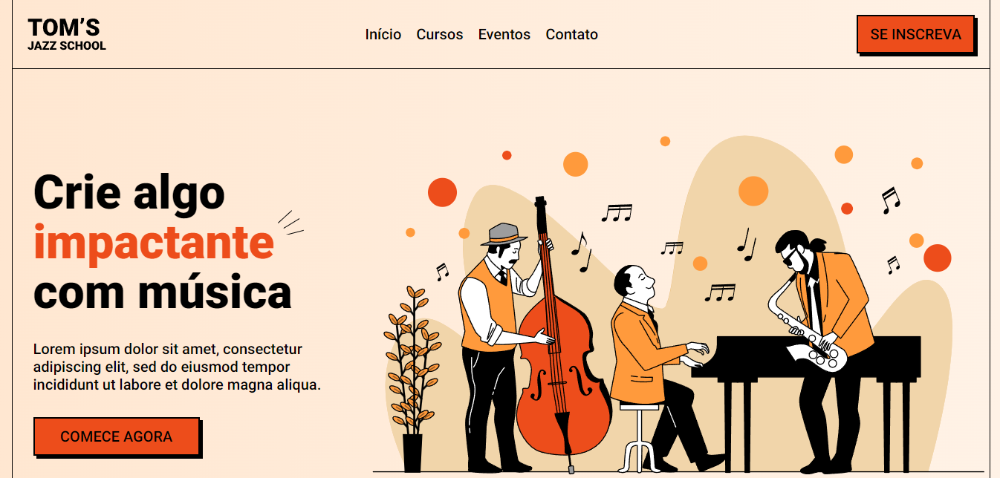
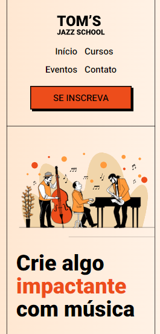
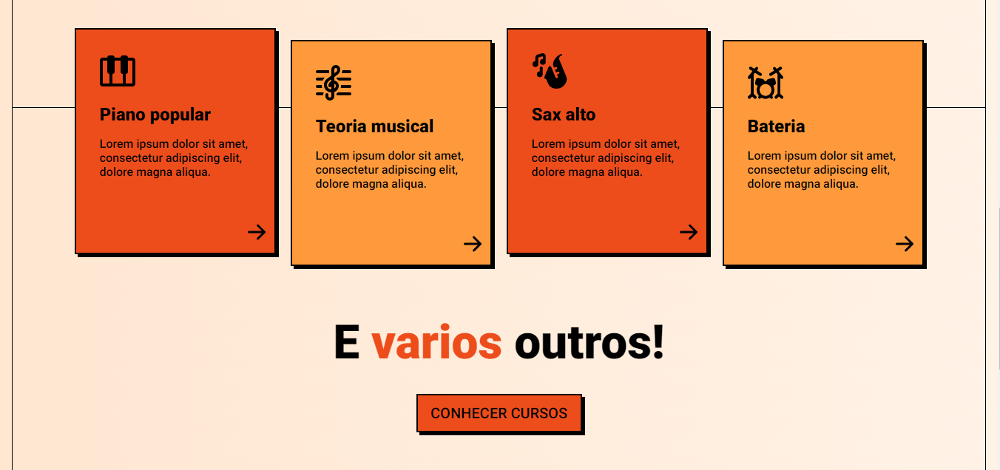
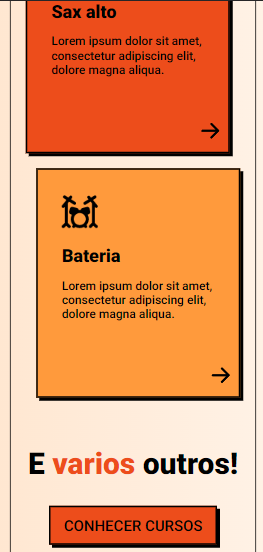
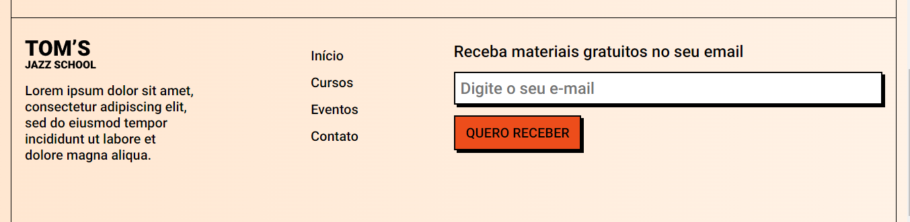
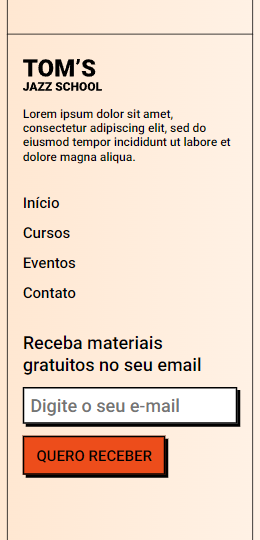

# TOM'S Jazz School | OneBitCode

Este projeto é uma aplicação front-end simples, desenvolvida com o objetivo de praticar os conceitos de HTML, CSS. Foi construida uma landing page para uma escola de música fictícia, a TOM'S Jazz School.

Foi utilizado o conceito de mobile first (aplicado para garantir que a interface funcione bem em dispositivos móveis.)

## Tecnologias
- HTML
- CSS

## Layout Figma

- [Layout da aplicação](https://www.figma.com/file/76GJ4uK7PyKeAo6dcpVyjA/Tom's-Jazz-School?type=design&node-id=0-1&mode=design&t=6Wo5FsnsUgFYizBa-0)

## Imagens do projeto

### Header desktop e mobile

 

### Main desktop e mobile

### Footer desktop e mobile

